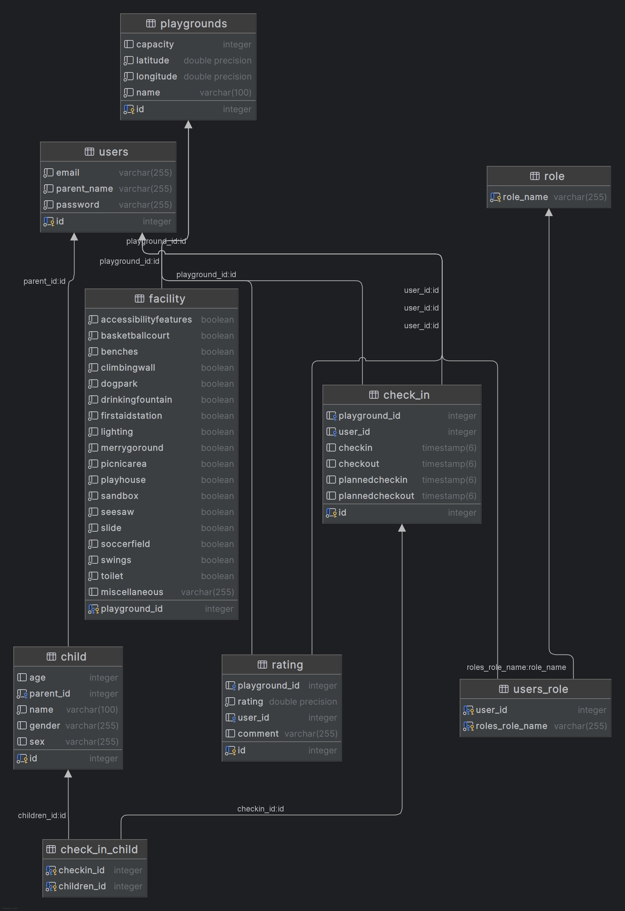

# Find en Legeplads

## Vision

This project is a backend API for managing and discovering playgrounds.\
The system allows users to view playgrounds, check in children, and
manage playground data with role-based access control.

------------------------------------------------------------------------

## Links

Portfolio website:\
https://luke-dkk.github.io/portfolio

Project overview video (max 5 min):
`<LINK>`{=html}

Deployed application:\
https://findenlegeplads.team-ice.dk/api/routes

Source code repository:\
https://github.com/luke-dkk/portfolio
------------------------------------------------------------------------

# Architecture

## System Overview

This project is built as a layered backend architecture using:

-   Controller layer (REST endpoints)
-   Service layer (business logic)
-   DAO layer (database access)
-   Entity layer (JPA entities)

Technologies used:

-   Java
-   Javalin
-   JPA / Hibernate
-   PostgreSQL
-   Docker & Docker Compose
-   Caddy (reverse proxy)
-   JWT authentication

------------------------------------------------------------------------

## Architecture Diagram

Client → Caddy → Javalin API → Service Layer → DAO → PostgreSQL

------------------------------------------------------------------------

## Key Design Decisions

### Authentication

Authentication is implemented using JWT tokens.

Users log in via `/api/auth/login` and receive a token, which must be
included in protected requests.

Example header:

    Authorization: Bearer <token>

------------------------------------------------------------------------

### Authorization (Roles)

Authorization is handled using roles defined directly in routes:

-   ANYONE → public endpoints
-   USER → authenticated users
-   ADMIN → restricted endpoints

Role validation is handled in a global middleware using
`beforeMatched()`.

------------------------------------------------------------------------

### Deployment

The application is deployed using Docker Compose with:

-   PostgreSQL database container
-   Backend services
-   Caddy reverse proxy
-   Watchtower for automatic container updates

------------------------------------------------------------------------

# Data Model

## ERD

The system contains the following main entities:

-   User
-   Role
-   Playground
-   Child
-   CheckIn

------------------------------------------------------------------------

### Register User

POST /api/auth/register

------------------------------------------------------------------------

### Check In Child

POST /api/playgrounds/{id}/checkins

------------------------------------------------------------------------

### View Routes (Debug)

GET /api/routes

------------------------------------------------------------------------

# User Stories

-   As anyone, I want to view curreent playgrounds without logging in
-   As a user, I want to register an account
-   As a user, I want to log in and receive a token
-   As a user, I want to add children to my account
-   As a user, I want to check my child into a playground
-   As an admin, I want to create and manage playgrounds

------------------------------------------------------------------------

# Development Notes

## Key Challenges

-   Setting up JWT authentication correctly
-   Handling role-based authorization in Javalin
-   Debugging Docker container communication
-   Configuring reverse proxy with Caddy

------------------------------------------------------------------------

## Lessons Learned

-   Environment variables must match exactly between Docker and Java
-   Docker volumes can prevent database initialization scripts from
    running
-   Reverse proxy misconfiguration can cause misleading API errors
-   Javalin route roles require `beforeMatched()` to work correctly

------------------------------------------------------------------------

# Conclusion

This project demonstrates:

-   REST API design
-   Authentication and authorization
-   Docker-based deployment
-   Integration with external APIs (Google Places)
